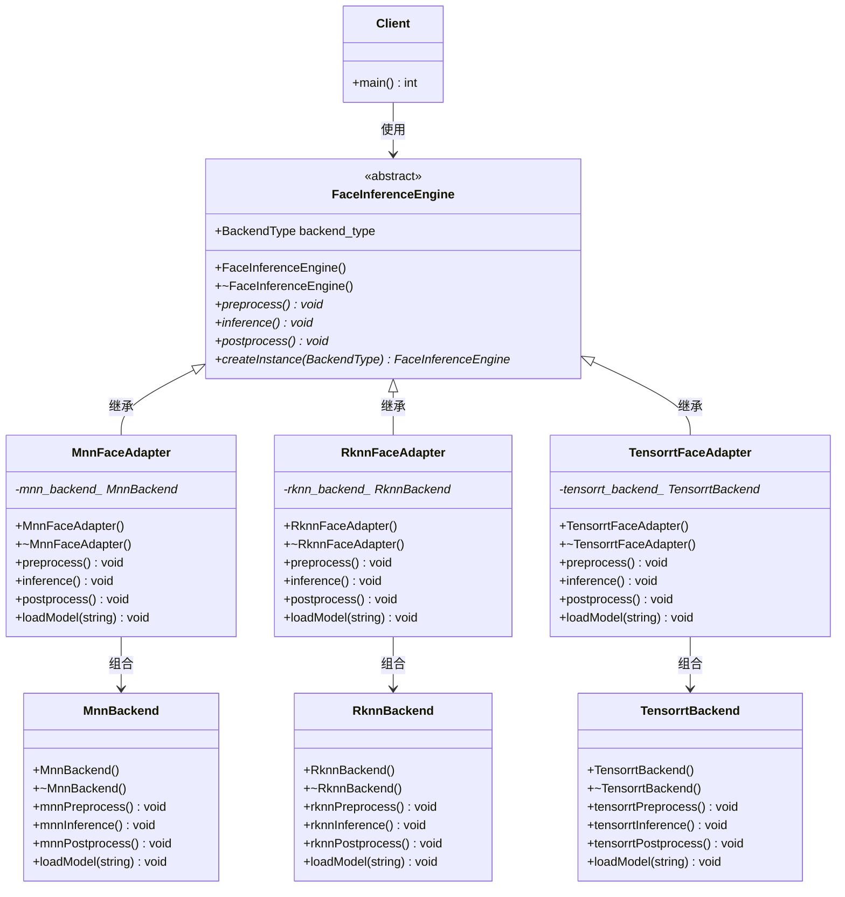

# 人脸识别推理引擎 - UML类图

## Adapter模式类图

## 类关系说明

### 继承关系
- `MnnFaceAdapter`、`RknnFaceAdapter`、`TensorrtFaceAdapter` 都继承自 `FaceInferenceEngine`
- 这实现了Adapter模式中的"适配器继承目标接口"

### 组合关系
- 每个适配器类都包含对应后端类的实例
- 这实现了Adapter模式中的"适配器包含被适配者"

### 依赖关系
- `Client` 依赖于 `FaceInferenceEngine` 接口
- 客户端通过工厂方法创建具体的适配器实例

## 设计模式角色

| 角色 | 类名 | 说明 |
|------|------|------|
| **Target（目标接口）** | `FaceInferenceEngine` | 客户端期望使用的统一接口 |
| **Adaptee（被适配者）** | `MnnBackend`、`RknnBackend`、`TensorrtBackend` | 需要适配的现有类 |
| **Adapter（适配器）** | `MnnFaceAdapter`、`RknnFaceAdapter`、`TensorrtFaceAdapter` | 将Adaptee接口转换为Target接口 |
| **Client（客户端）** | `Client` | 使用Target接口的代码 |

## 方法映射关系

### MNN适配器方法映射
| Target接口 | Adapter实现 | Adaptee方法 |
|------------|-------------|-------------|
| `preprocess()` | `MnnFaceAdapter::preprocess()` | `MnnBackend::mnnPreprocess()` |
| `inference()` | `MnnFaceAdapter::inference()` | `MnnBackend::mnnInference()` |
| `postprocess()` | `MnnFaceAdapter::postprocess()` | `MnnBackend::mnnPostprocess()` |

### RKNN适配器方法映射
| Target接口 | Adapter实现 | Adaptee方法 |
|------------|-------------|-------------|
| `preprocess()` | `RknnFaceAdapter::preprocess()` | `RknnBackend::rknnPreprocess()` |
| `inference()` | `RknnFaceAdapter::inference()` | `RknnBackend::rknnInference()` |
| `postprocess()` | `RknnFaceAdapter::postprocess()` | `RknnBackend::rknnPostprocess()` |

### TensorRT适配器方法映射
| Target接口 | Adapter实现 | Adaptee方法 |
|------------|-------------|-------------|
| `preprocess()` | `TensorrtFaceAdapter::preprocess()` | `TensorrtBackend::tensorrtPreprocess()` |
| `inference()` | `TensorrtFaceAdapter::inference()` | `TensorrtBackend::tensorrtInference()` |
| `postprocess()` | `TensorrtFaceAdapter::postprocess()` | `TensorrtBackend::tensorrtPostprocess()` |

## 设计优势

1. **接口统一**: 客户端可以使用统一的接口调用不同的推理后端
2. **扩展性好**: 添加新后端只需实现对应的Backend和Adapter类
3. **解耦合**: 客户端与具体后端实现完全解耦
4. **可维护性**: 每个后端的实现独立，便于维护和测试
5. **符合开闭原则**: 对扩展开放，对修改封闭

## 使用场景

- 需要统一多个不同推理框架的接口
- 希望客户端代码与具体推理后端解耦
- 需要支持多种推理后端，但希望使用统一的调用方式
- 在现有系统中集成新的推理后端 